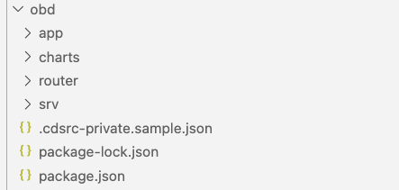

# Understand the Repository Structure

This part of the tutorial will briefly outline the structure of **code** directory, so you're comfortable navigating through the provided GitHub repository. 

- [Understand the Repository Structure](#understand-the-repository-structure)
  - [1. Overview](#1-overview)
  - [2. API Service](#2-api-service)
  - [3. Application](#3-application)
  - [4. API Broker](#4-api-broker)
  - [5. Helm Charts](#5-helm-charts)
  - [6. Tenant data model](#6-tenant-data-model)
  - [7. Shared data model](#7-shared-data-model)
  - [8. Extension Files](#8-extension-files)
  - [9. HTTP Test Files](#9-http-test-files)
  - [10. Onboarding Service](#10-onboarding-service)
  - [11. Application Router](#11-application-router)
  - [12. Annotation Files](#12-annotation-files)
  - [13. Business Application Service](#13-business-application-service)
  - [14. Test objects](#14-test-objects)

Also, check out our **Explore the components** chapter ([click here](../9-explore-the-components/README.md)), which describes the various SaaS application components and their tasks in greater detail ([click here](../7-explore-the-components/README.md)). For now, let us start with a brief overview, before deep-diving into the different sub-directories. 


## 1. Overview

The **code** directory of our GitHub repository consists of several sub-directories containing the API (Service) Broker, the API Service, and the different application layers like User Interface, the Backend Business Application service layer, and the data models deployed in a tenant-specific and shared database container. Furthermore, you can find the Helm Charts (required for the Kyma deployment), content supporting local testing or even examples how to extend the SaaS application. 

| | |
|:--: | :--- |
| [](./images/Repo_Structure_All.png?raw=true) | <br> <br> **api -** CAP-based API service <br> **app -** SAP Fiori Elements UI modules <br> **broker -** API Service Broker <br> **charts -** Helm charts <br> **db -** Tenant data model <br> **db-com -** Shared/Common data model <br> **ext -** CAP-based SaaS extension <br> **http -** HTTP files for testing purposes <br> **obd -** Onboarding Service (Expert Feature) <br> **router -** Application Router <br> **srv -** CAP-based Business Application service <br> **test -** Unit tests and sample data <br> <br> **.cdscr-private.sample.json -** K8S binding samples for local testing <br> **default-env.sample.json -** Environment variables for local testing  <br> **package.json -** CDS configs and dependencies for local testing |

> **Hint** - Each of our CAP-based application components like the SaaS Backend Service or the API Service contain a dedicated *package.json* file. Instead of using the root-level *package.json* file we decided to provide component specific dependencies and CDS production profile configurations.

## 2. API Service

The **api** directory contains the implementation of the **CAP-based** API Service which can be used by SaaS consumers to upload or maintain data in their Tenant database containers. Further details can be found in a separate part of this tutorial ([click here](../6-push-data-to-saas-api/README.md)).

> **Hint** - The API Service Docker Image is build using *Cloud Native Buildpacks*, therefore the directory does not contain a separate Dockerfile. Further details on the build process are provided in a separate part of the tutorial ([click here](../3-build-your-docker-images/README.md))!

| | |
|:--: | :--- |
| [](./images/Repo_Structure_API.png?raw=true) |  **api-service.cds -** CAP-based API Service definition <br> **api-service.js -** CAP-based API Service handler  <br> **package.json -** Node.js dependencies and start script <br> **server.js -** Custom server.js for health-check endpoints |


## 3. Application

Besides the **html5-deployer** directory (containing the **HTML5 Application Deployer** - find details [here](https://cap.cloud.sap/docs/guides/deployment/deploy-to-kyma#ui-deployment)), the **app** directory contains all SAP Fiori Elements modules, which result in dynamically generated UIs, based on the OData Backend Service annotations. During the UI build process, all four UI modules are zipped and copied into a *resources* folder within the *html5-deployer* directory. This folder is created during the very first build.

> **Hint** - The **HTML5 Apps Deployer** Docker Image is build using an existing *Docker Image* maintained by SAP, which is referenced in the respective Dockerfile. Further details on the build process are provided in a separate part of the tutorial ([click here](../3-build-your-docker-images/README.md))!

| | |
|:--: | :--- |
| [](./images/Repo_Structure_App.png?raw=true) |  **html5-deployer -** HTML5 Application Deployer configuration <p style='padding-left:1em'> **.dockerignore -** Ignores package.json for docker build <br> **Dockerfile -** Docker image based on sapse/html5-app-deployer <br> **package.json -** Required for local testing only </p> **ui-admin-projects -** Admin UI for project management <p style='padding-left:1em'> **webapp -** UI5 applicaton resources <br><p style='padding-left:2em'>**ext -** Fiori Elements extensions <br> **i18n -** Translation files <br> **utils -** Reusable coding <br> **Component.js -** Component coding <br> **index.html -** For standalone usage  <br> **manifest.json -** SAPUI5 manifest file  </p><p style='padding-left:1em'> **package.json -** Required for build process <br> **ui5-deploy.yaml -** Required for build process <br> **xs-app.json -** HTML5 App Repository routes <br>(copied to webapp folder during UI build) </p> **ui-admin-users -** Admin UI for user management <br> **ui-public-assessments -** UI for assessment management <br> **ui-public-flp -** UI for sandbox launchpad  <br> **ui-public-projects -** UI for viewing project details <br> <br> **index.html** - Sandbox launchpad for cds watch |

The **ui-public-flp** UI module contains a Sandbox Launchpad. The [Application Router](#10-application-router) **welcomeFile** property is routing to this module stored in the HTML5 Application Repository. Keep in mind, that when using UI5 applications in a Launchpad context, always the UI5 release defined for the actual Launchpad is being used for your SAPUI5 applications. 


## 4. API Broker

The **broker** directory contains the API Service Broker implementation. The catalog.json file (which is required to define service plans provided by the Service Broker) is part of the Helm Charts ([click here](../../../code/charts/sustainable-saas/charts/susaas-broker/templates/broker-catalog.yaml)), as the required details are only available upon deployment to your Kyma Cluster.

> **Hint** - The API Service Broker Docker Image is build using *Cloud Native Buildpacks*, therefore the directory does not contain a separate Dockerfile. Further details on the build process are provided in another part of the tutorial!

| | |
|:--: | :--- |
| [](./images/Repo_Structure_Broker.png?raw=true) | **package.json -** Node.js dependencies and start script <br> **start.js -** Custom start script for API Service Broker <br> (reading credentials from env variables) |


## 5. Helm Charts

The **charts** directory contains all relevant [**Helm**](https://helm.sh/) Charts for the deployment of the Sustainable SaaS sample application. **Helm** is one of the most popular package managers for Kubernetes environments and can therefore also be used to deploy artifacts to your Kyma Cluster! 

If you are new to the topics of **Kubernetes**, **Helm** and **Kyma** please make sure to read our dedicated chapters on these topics ([click here](../8-kyma-resources-helm/README.md))! For a quick start, we also highly recommend to check out the following blog post on "[Surviving and Thriving with the SAP Cloud Application Programming Model: Deployment to SAP BTP, Kyma runtime](https://blogs.sap.com/2023/03/07/surviving-and-thriving-with-the-sap-cloud-application-programming-model-deployment-to-sap-btp-kyma-runtime/)". Max gets you covered in his great and profound way of describing latest innovations in the SAP ecosphere. 

While in Cloud Foundry, we make use of the **mta.yaml** deployment descriptor, in the Kyma environment, we rely on [Helm](https://helm.sh/) as deployment solution. Helm allows you to generate required Kubernetes manifest (.yaml) files, in a structured and template-driven approach. While Helm feels overwhelming in the beginning, you will quickly realize and appreciate the amazing benefits. In case you are new to Helm, you can find a dedicated section on these and further Kyma related topics in one of the next chapters ([click here](../8-kyma-resources-helm/README.md)).

The **Sustainable SaaS** sample application itself is based on a a so-called **Umbrella Chart**. So besides dedicated **Helm Charts** for each application component (SaaS Backend Service, Application Router, API Service, API Service Broker), the provided Umbrella Chart allows a combined deployment of all contained Helm (Sub-) Charts. As mentioned, you can learn more about Helm Charts as well as the various templates and resources sin a dedicated tutorial chapter ([click here](../8-kyma-resources-helm/README.md))!

> **Note** -As the **SAP Alert Notification Service** can be deployed only once per Kyma Namespace, a separate so-called **Helm Chart** is used in our sample setup. 


| | |
|:--: | :--- |
| [](./images/Repo_Structure_Chart.png?raw=true) |  **alert-notification -** Alert Notification Service <br> <p style='padding-left:1em'> **templates -** Templates to generate Kubernetes manifest files <br> **Chart.yaml -** YAML file containing information about the chart <br> **values.yaml -** Default configuration values for this chart </p> <br> **sustainable-saas -** Sustainable SaaS Application <br> <p style='padding-left:1em'> **charts -** Umbrella Chart (Sub-) Charts <p style='padding-left:2em'> **susaas-api -** API Service Helm (Sub-)Chart <p style='padding-left:3em'> **templates -** Templates to generate Kubernetes manifest files <br> **Chart.yaml -** YAML file containing information about the chart <br> **values.yaml -** Default configuration values for this chart </p> <p style='padding-left:2em'> **susaas-broker -** Service Broker Helm (Sub-)Chart <br> **susaas-router -** Application Router Helm (Sub-)Chart <br> **susaas-srv -** Backend Service Helm (Sub-)Chart </p><p style='padding-left:1em'>**templates -** Templates to generate Kubernetes manifest files <br> (Kubernetes Jobs and shared SAP BTP Service Instances) <br> **Chart.yaml -** YAML file containing information about the umbrella chart <br> **values.schema.json -** JSON Schema structure definition for values.yaml <br> **values.yaml -** Default configuration values for the umbrella chart <br><br> **xs-security.json -** xsuaa service configuration  |

> **Hint** - Learn more about Helm Charts in the official [Helm documentation](https://helm.sh/docs/topics/charts/).


## 6. Tenant data model

The **db** directory contains the definition of our Tenant data model, which is deployed to a separate isolated SAP HANA Cloud HDI (HANA Deployment Infrastructure) database containers for each and every SaaS Tenant upon subscription. Besides a **CDS-based** data model, the directory also contains SAP HANA native objects (e.g., hdbgrants or synonyms) for accessing the shared HDI database container. Make sure to run a **cds build --production** in case of changes to the Tenant data model before building new Docker Images of your SaaS Backend Service.

> **Hint** - As the Tenant data model is part of our SaaS Backend Service and deployed to new Tenant database containers at runtime, there is no need to build a separate Docker Image for this component. The data model definition is stored within the Backend Service and the mtxs Deployment Service ([click here](https://cap.cloud.sap/docs/guides/multitenancy/mtxs#deploymentservice)) allows an automated deployment to new database containers. 

> **Important** - Based on the CDS profiles used in *cds watch* or *cds build*, the Tenant data model includes or excludes **sample data**. For **local testing** using sqlite, master data tables (e.g., Currencies or Countries) and sample values are part of the Tenant data model. For a **production** builds targeting SAP HANA Cloud, these tables and sample values are replaced by views pointing to a shared database container. Also check the *package.json* profile **db-ext** for a better understanding of this approach.

| | |
|:--: | :--- |
| [](./images/Repo_Structure_Tenant_Db.png?raw=true) | <br><br> **cfg -** Configuration for shared container access <br> **hana -** Data model extension for production build <br> **sqlite -** Data model extension for local testing <br> **src -** Native SAP HANA database objects <br><p style='padding-left:1em'> **functions -** Sample function <br> **procedures -** Sample stored procedure <br> **roles -** Sample schema roles <br> **synonyms -** Synonyms for SYS and shared container </p> **data-models.cds -** CAP Tenant data model <br> **data-types.cds -** CAP data model types <br> **undeploy.json -** Undeploy configuration |
 

## 7. Shared data model

The **db-com** directory contains the definition of the shared data model, which is accessible from all isolated Tenant database containers. It is used for data required and shared by all Consumer Tenants (e.g., master data like Currencies, Languages, or Countries). To provide master data for Currencies, Languages and Countries, we make use of the **@sap/cds-common-content** npm package ([click here](https://www.npmjs.com/package/@sap/cds-common-content)). It is defined as a dependency in the root [package.json](../../../code/package.json) file and referenced in the CAP data model definition of our shared data model.

```json
using {
    sap.common.Languages as Languages,
    sap.common.Currencies as Currencies,
    sap.common.Countries as Countries
} from '@sap/cds-common-content';
```

The shared data model has to be deployed separately into a dedicated SAP HANA Cloud HDI database container during deployment of the SaaS sample application. Therefore, a separate Docker Image is being build, which is then used by a Kubernetes Job initiating the actual deployment. 

> **Hint** - The Docker Image deploying the shared data model to a dedicated database container, is build using *Cloud Native Buildpacks*, therefore the directory does not contain a separate Dockerfile. Further details on the build process are provided in a separate part of the tutorial ([click here](../3-build-your-docker-images/README.md))!

| | |
|:--: | :--- |
| [](./images/Repo_Structure_Shared_Db.png?raw=true) | **src -** Native SAP HANA database objects <br> <p style='padding-left:1em'>  **\*_ACCESS.hdbrole -** Roles for access from Tenant containers </p>  **data-model.cds -** Shared CAP data model <br> **undeploy.json -** Undeploy configuration |


## 8. Extension Files

The **ext** directory contains files for a SaaS extension project, which can be used by SaaS subscribers to extend an existing SaaS Tenant instance. Please check the Expert Features for further details ([click here](../../4-expert/consumer-extensibility/README.md)).

| | |
|:--: | :--- |
| [](./images/Repo_Structure_Extension.png?raw=true) | **app -** CAP extensions for data model, services and SAP Fiori <br> <p style='padding-left:1em'> **data -** Sample data for extension fields <br> **extension.cds -** CAP data model extension definitions <br> **fiori.cds -** Fiori Elements extension definitions </p> **i18n -** Translations for extensions |


## 9. HTTP Test Files

The **http** directory contains HTTP files allowing you to test the SaaS API endpoints from a SaaS Consumer perspective. Further details on how to use these HTTP files can be found in a separate part of our tutorial ([click here](../6-push-data-to-saas-api/README.md)).

| | |
|:--: | :--- |
| [](./images/Repo_Structure_Http.png?raw=true) |  **api\*.http -** HTTP files for API testing <br> **tenantUpgrade.http -** Sample HTTP call for Tenant upgrades |


## 10. Onboarding Service

The **obd** directory contains a separate user interfaces and workloads, including a CAP Service and an Application Router, used to offer a Self-Onboarding Service to customers interested in signing-up for a SaaS solution. Further details on how to deploy the respective Helm chart to your own Kyma Cluster after setting up the SaaS application, can be found in the respective Expert Feature chapter [click here](../../4-expert/onboard-automation-domain/README.md).

[](./images/Repo_Structure_Onboarding.png?raw=true)


## 11. Application Router

The **router** directory contains all files of the Application Router required by our SaaS sample application. In this case, only the *xs-app.json* file and a health-check is required. 

> **Hint** - The Application Router Docker Image build process makes use of the official *sapse/approuter* Docker Image. Further details on the build process are provided in a separate part of the tutorial ([click here](../3-build-your-docker-images/README.md))!

| | |
|:--: | :--- |
| [](./images/Repo_Structure_Router.png?raw=true) |  **.dockerignore -** Ignore package.json for docker build <br> **Dockerfile -** Docker image based on sapse/approuter <br> **health.html -** Used for pod health checks <br> **package.json -** Required for local testing only  <br> **xs-app.json -** Route definitions for productive usage <br>  |


## 12. Annotation Files

The **annotations** folder in the **srv** directory contains all service annotations required to generate the Fiori Elements UIs of our sample application. These annotations define the capabilities of the OData Services but also set the layouts of the SAP Fiori Elements user interfaces. 

> **Hint** - As for any other changes to the SaaS Backend Service, make sure to run a **cds build --production** in case of any changes to the annotation files before building a new Docker Image!

| | |
|:--: | :--- |
| [](./images/Repo_Structure_Annotations.png?raw=true) |  **admin -** Admin Service annotations <br> **public -** User Service annotations <br><p style='padding-left:1em'> **capabilities.cds -** Service capability annotations <br>**fieldControls.cds -** Service field control annotations <br>**layouts_\*.cds -** Fiori Elements layout annotations </p> **labels.cds -** Label annotations <br> **valueHelp.cds -** Value help annotations  <br> |

> **Hint** - Yes, these annotation files can also be part of your UI modules as you can see in other tutorials. Feel free to move them around if you feel more comfortable storing the annotations among your actual UI components. 


## 13. Business Application Service

The rest of the **srv** directory contains the implementation of our Business Application or central SaaS Backend Service. This includes OData-Services (*admin-service.js/cds* and *user-service.js/cds*) for our Fiori Elements UIs, as well as the automation logic executed on the subscription of new consumer-tenants (*provisioning.js*). The corresponding subscription service endpoints are exposed by using the **CAP mtxs** ([click here](https://cap.cloud.sap/docs/guides/multitenancy/mtxs) for further details). 

```json
 "cds": {
    "requires": {
      "multitenancy": true
    }
  }
```

**Onboarding Automation**

A lot of the Tenant onboarding steps have been automated using platform APIs and SAP BTP services. Start from the *provisioning.js* file and deep-dive into the various utilities like e.g., *apiRule.js*, creating API Rules for new subscribers by interacting with the Kyma API Server. 

> **Hint** - The SaaS Backend Service Docker Image is build using *Cloud Native Buildpacks*, therefore the directory does not contain a separate Dockerfile. Further details on the build process are provided in a separate part of the tutorial ([click here](../3-build-your-docker-images/README.md))!

| | |
|:--: | :--- |
| [](./images/Repo_Structure_Service.png?raw=true) | **i18n -** Language files <br> **utils -** Utilities (mainly for automation purposes) <br><p style='padding-left:1em'> **alertNotification.js -** Alert Notification utilities <br> **apiRule.js -** Kyma API Rule utilities <br> **automator.js -** Tenant onboarding automation <br>**cis-central.js -** Cloud Management Service utilities <br>**destination.js -** Destination Service utilities <br>**service-manager.js -** Service Manager utilities <br>**token-utils.js -** Token handler utilities <br>**user-management.js -** User management utilities </p> **admin-service.cds -** CAP Admin Service definition <br>**admin-service.js -** CAP Admin Service handler <br> **annotations.cds -** Annotation CDS file references <br>**provisioning.js -** Tenant provisioning handler <br> **public-service.cds -** CAP User Service definition <br> **public-service.js -** CAP User Service handler <br> **server.js -** Health endpoints and custom provisioning  |


## 14. Test objects

The **test** directory contains sample data for local development and testing purposes as well as sample unit tests. 

> **Hint** - These files should not be part of a productive deployment and are not part of the **production** build profile. 

| | |
|:--: | :--- |
| [](./images/Repo_Structure_API.png?raw=true) | **data -** Sample data for Tenant data model <br><br> **index.cds -** CDS file for builder <br> **test.js -** Sample unit tests <br> |