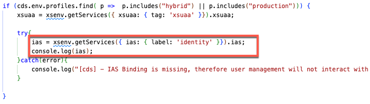
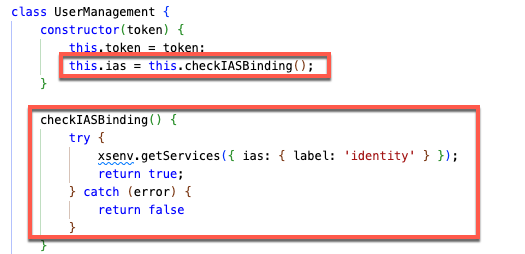
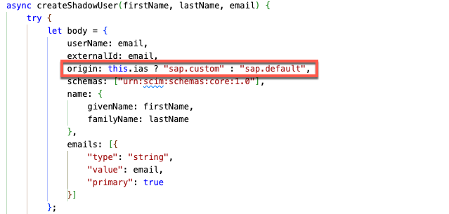
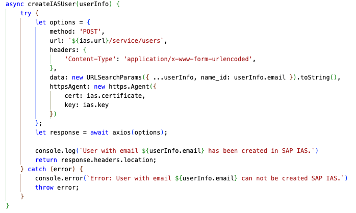

# Advanced Version Repository details

This part of the tutorial will briefly outline where to find the major differences of the **Advanced Version**. Compared to the **Basic Version**, the **Advanced Version** requires you to enable a few additional settings in the *values.yaml* file of our **Umbrella Chart**, and will also make use of additional code snippets based on additional Service Instances and Service Bindings like **Cloud Identity Service**. 

- [Advanced Version Repository details](#advanced-version-repository-details)
  - [Umbrella Chart Updates](#umbrella-chart-updates)
    - [Central User Management](#central-user-management)
    - [SAP API Management Integration](#sap-api-management-integration)
  - [Additional Code Snippets](#additional-code-snippets)


## Umbrella Chart Updates

In the Umbrella Chart, a you need to toggle the creation of additional services and bindings which are not required in the **Basic Version**. The respective steps will also be part of the upcoming chapters, still we will list the required **values.yaml** changes in this overview. 


### Central User Management

Enabling the following configuration will create a new **Cloud Identity** Service Instance of type **application** upon *helm install* or *helm upgrade*. Please make sure to read the respective [chapter](../3-central-user-management-ias/README.md) before enabling this scenario!

> **Important** - The Integration with SAP Identity Authentication requires both additional entitlements in your SAP BTP Subaccount as well as a SAP Identity Authentication tenant.

```yaml 
# SAP Cloud Identity Service Instance
# Provides an SAP IAS integration for central user management
identity:
  enabled: true # Enable if an SAP IAS instance is configured as Trusted Identity Provider
  serviceOfferingName: identity
  servicePlanName: application
    ...
```

Enabling the following configuration will create a Service Binding between your **Backend Service** and the above **Cloud Identity** Service Instance upon *helm install* or *helm upgrade*. In this case a special binding type (X.509) is required, while for all other Service Bindings we are using the standard Client Credential binding. Please make sure to read the respective [chapter](../3-central-user-management-ias/README.md) before you enable this scenario!

> **Important** - The Integration with SAP Identity Authentication requires both additional entitlements in your SAP BTP Subaccount as well as a SAP Identity Authentication tenant.

```yaml 
srv:
  port: 8080
  bindings:
    xsuaa:
      serviceInstanceName: xsuaa
    ...
    identity:
      # Only enable if Cloud Identity Service instance is enabled in Umbrella Chart 
      enabled: true 
      serviceInstanceName: identity
      # SAP IAS binding requires X.509 certificate based credentials
      parameters:
        credential-type: X509_GENERATED
  image:
    ...
```


### SAP API Management Integration

By enabling and updating the following configuration, your application is ready for the integration with SAP API Management. Please make sure to read the respective [chapter](../8-integrate-sap-api-management/README.md) before you enable this scenario!

> **Important** - The Integration with SAP API Management requires additional entitlements in your SAP BTP Subaccount.

```yaml 
# SaaS API Workload
api:
  ...
  # Settings for SAP API Management integration
  apim:
    # Only enable if SAP API Management instance is configured
    enabled: true
    # SAP API Management runtime host w/o "https://" or port
    host: sap-demo.prod.apimanagement.us20.hana.ondemand.com
    # Port of SAP API Management runtime host
    port: 443
    # Path of API Proxy in SAP API Management
    path: susaas-api
    # Provide details of the API XSUAA Service Instance
    # Those details can be found in the respective Kyma Secret
    # The Secret is created for the xsuaa-apim serviceKey
    xsuaa: 
      # Provide the XSUAA tenant host without https://
      # e.g., sap-demo.authentication.us20.hana.ondemand.com
      host: sap-demo.authentication.us20.hana.ondemand.com
      # Provide the xsappname of your API XSUAA Service Instance 
      # Add the prefix "sb-" to the xsappname like, sb-susaas-api-default
      sub: sb-susaas-api-default
  resources:
    ...
```


## Additional Code Snippets 

The additional code snippets serving the **Advanced Version** features of this tutorial, can be found in the **User Management** utilities of our **Backend Service**. Visit the respective utils file ([srv/utils/user-management.js](../../../code/srv/utils/user-management.js)) to find the code snippets described. 

> **Hint** - Compared to the Cloud Foundry version of this tutorial, we decided to merge the **Basic** and **Advanced Version** into the same codeline, by simply checking the availability of the SAP Cloud Identity Service Binding. 

| **Code Sample** | **Description**  |
|  :----   |          :---  |
|  [](./images/UserManagement01.png?raw=true) | Read Cloud Identity service binding details using xsenv. |
|  [](./images/UserManagement02.png?raw=true) | Methods for checking the Cloud Identity service binding.  |
|  [](./images/UserManagement03.png?raw=true) | Setting the user origin based on SAP IAS usage.  |
|  [](./images/UserManagement04.png?raw=true) | Methods for creating and deleting users in SAP IAS. |
