# Custom Domain Usage

In this section you will be learning how to use a your own custom domain via using Cloud DNS service of Google Cloud Platform(GCP) for 
the workloads in your SAP Kyma Runtime.

- [Custom Domain Usage](#custom-domain-usage)
  - [1. Prerequisites for setting up your custom domain](#1-prerequisites-for-setting-up-your-custom-domain)
  - [2. Creating a DNS Zone for your domain with GCP Cloud DNS](#2-creating-a-dns-zone-for-your-domain-with-gcp-cloud-dns)
  - [3. Go to your domain registrar and adopt your nameservers (DNS Propagation)](#3-go-to-your-domain-registrar-and-adopt-your-nameservers-dns-propagation)
  - [4. Create a service account on your ](#4-create-a-service-account-on-your-gcp-account)
  - [5. Create secret with your GCP Service Account for GCP interaction](#5-create-secret-with-your-gcp-service-account-for-gcp-interaction)
  - [6. DNS Provider on SAP Kyma Runtime](#6-dns-provider-on-sap-kyma-runtime)
    - [6.1. Create DNS Provider](#61-create-dns-provider)
    - [6.2. Create DNS Entry](#62-create-dns-entry)


## 1. Prerequisites for setting up your custom domain

- You enabled and have access to your SAP Kyma Runtime
- You already own a domain from any domain registrar
- You installed kubectl on your local device


## 2. Creating a DNS Zone for your domain with GCP Cloud DNS 

Go and login your [](https://console.cloud.google.com/).
After the login go to your *Network Services* and Click *DNS Zones* as shown below to see your domain. 

> **Important**: If you have already a public DNS Zone for your domain which you will use. You should skip this step. 
> For example, in the picture above, for DNS name *google.sap-demo.com* the zone is already created and it is public.

Click the *Create Zone* button, if you do not have already a DNS Zone for your domain.

[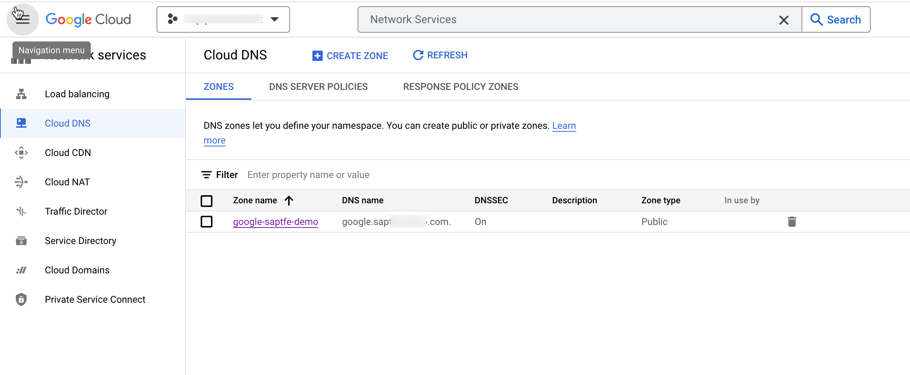](./images/gcp-dns-zone-overview.png?raw=true)

After that, fill the fields as shown below and hit create.

[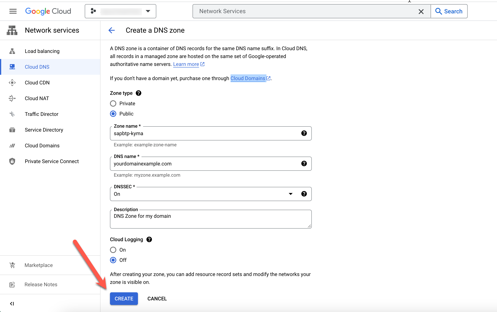](./images/cr-zone.png?raw=true)

After the creation you should see two records has been automatically created as shown below.
One is the **SOA** record and the other one is **NS** record.

[](./images/cr-zone.png?raw=true)


The **SOA** (Start of Authority) DNS record is a fundamental DNS resource record type used to indicate authoritative information about a DNS zone. 
The **NS** (Nameservers) records shows the nameservers responsible to respond incoming DNS queries for your domain.

Open the NS record as shown below and save your nameservers, you will need them in the next step

[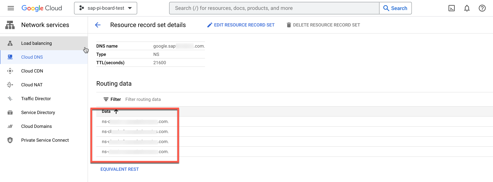](./images/ns-servers.png?raw=true)


## 3. Go to your domain registrar and adopt your nameservers (DNS Propagation)

When you change the nameservers for a domain, the change may take up to 24-48 hours to take affect. This is known as *DNS propagation*.

On previous step your you have seen the nameservers of your DNS Zone. 
In this step, you need to go to your domain registrar, and modify existing nameservers with the nameservice you got from your DNS Zone. in short, you will setup the DNS propagation.

Since it may vary across different domain registrars, you should check with your domain registrar about how to do the DNS propagation.

> **Warning**: After you modified your DNS nameservers, it might take up to 48 hours to propagete. There is no exact way to tell when propagation is complete for you as it depends on different factors. You can use [GSuite-Toolbox Dig](https://toolbox.googleapps.com/apps/dig/) to check your propagation status.


## 4. Create a service account on your  

A service account is a special kind of account typically used by an application or compute workload rather than a person. 
In this section, you will create a service account in your , which will be used later by SAP Kyma Runtime.

Go to IAM & Admin section on your .
Then click the service accounts as shown below. 

[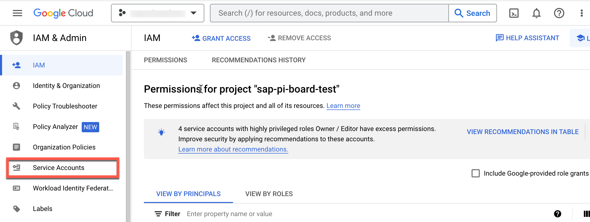](./images/sa-entry.png?raw=true)

After that click create service account.

[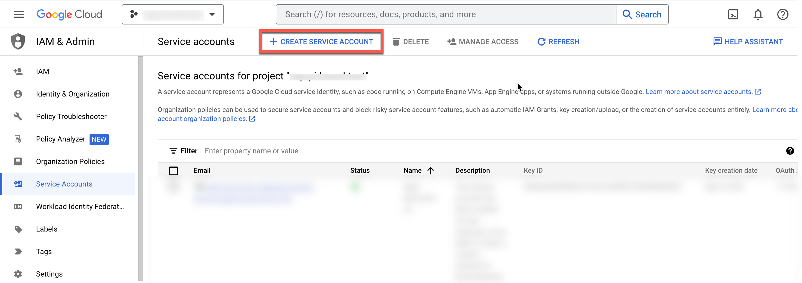](./images/sa-create-click.png?raw=true)

Fill the form as shown below, and click "Create and Continue".

[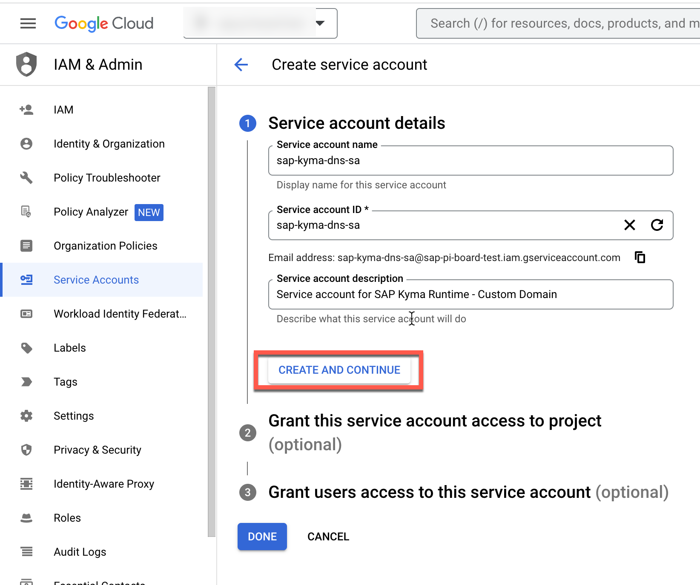](./images/sa-create-continue.png?raw=true)

Assign DNS Administrator role to and click "Continue".

[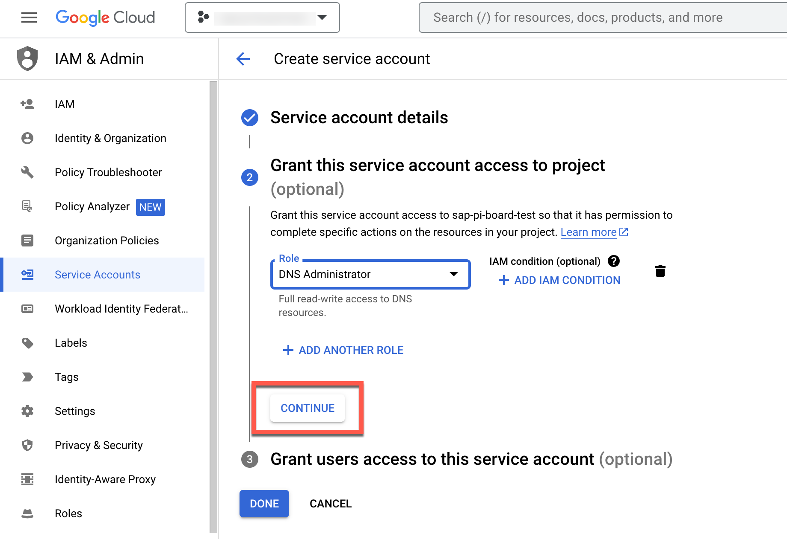](./images/assign-role-sa.png?raw=true).

Then click "Done".

[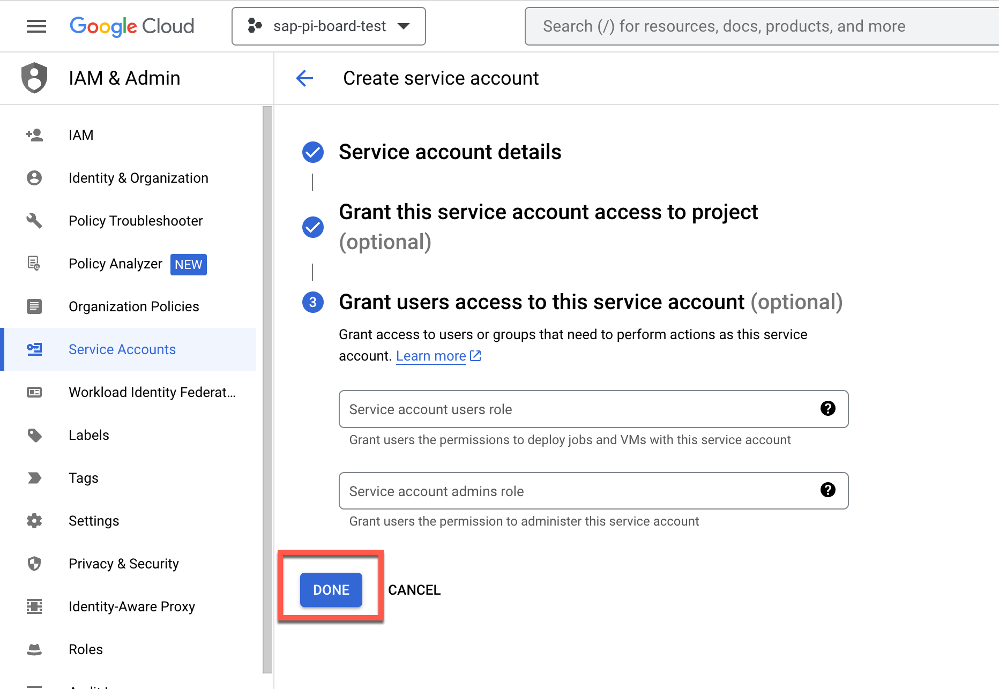](./images/sa-complete.png?raw=true).

After that you should see that your service account is created.
Now you should click on your service account and go to "Keys" tab.
Create a key as shown below.

[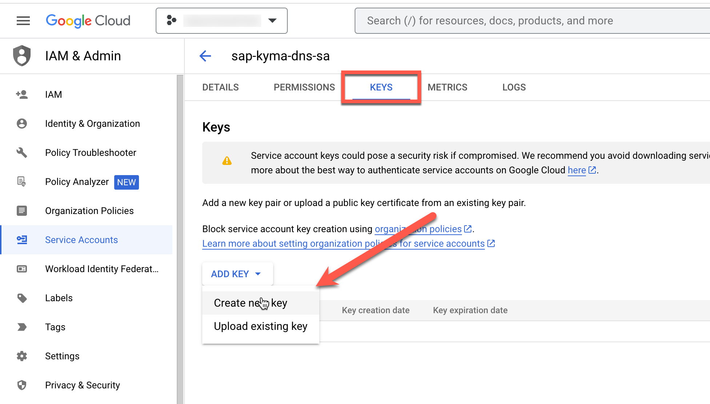](./images/sa-create-key.png?raw=true).

You should now choose JSON, and hit "Create".
After that your key will be downloaded in your local computer. Please rename it as **serviceaccount.json** and store it securely.

[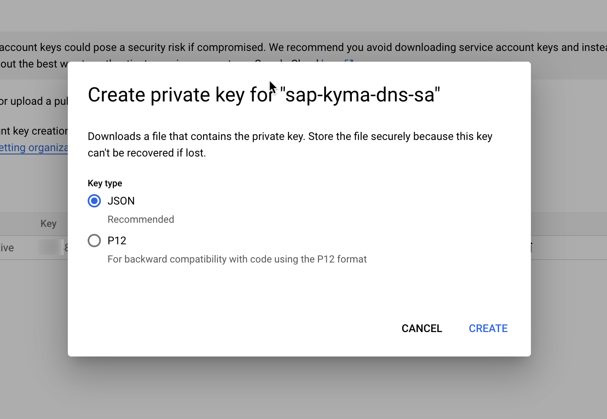](./images/sa-create-key-json.png?raw=true).


## 5. Create secret with your GCP Service Account for GCP interaction

On previous step, you have created a service account from your .
The file you have downloaded on previous step will be used to create a kubernetes secret on this step.

Your Kyma environment will use this secret to connect your Cloud DNS service on your .

Before all, please create a namespace so your Custom Domain changes can remain there.

```sh
kubectl create namespace gcp-gateway
```

Then you should create a secret, via using your downloaded **service-account.json** file on previous step.

```sh
 kubectl create secret generic gcp-dns-sa-secret --from-file='<path-of-your-serviceaccount.json>' -n gcp-gateway
```


## 6. DNS Provider on SAP Kyma Runtime 

DNS Provider is a Kubernetes custom resource definition (CRD) that is used to manage external DNS providers in a Gardener Kubernetes cluster. Since SAP Kyma Runtime also runs on top of Gardener project by SAP, this also applies to your SAP Kyma cluster.

Typical dns-provider.yaml file would look like below.

```yaml
apiVersion: dns.gardener.cloud/v1alpha1 
kind: DNSProvider 
metadata:
  name: gcp-dns-provider
  labels:
    app.kubernetes.io/name: gcp-dns-provider
  annotations:
    dns.gardener.cloud/class: garden
  namespace: gcp-gateway
spec:
  type: google-clouddns 
  secretRef:
    name: gcp-dns-sa-secret
    namespace: gcp-gateway
  domains:
    include:
      - '*.kyma.<yourdomain>' ## replace this line in original domain
```

> **Hint** : For other supported DNS providers, please refer [here](https://gardener.cloud/docs/extensions/others/gardener-extension-shoot-dns-service/docs/usage/dns_names/). 


### 6.1. Create DNS Provider 

First go to directory **./docu/4-expert/custom-domain-usage/resources**

```sh
cd ./docu/4-expert/custom-domain-usage/resources
```

Then open the [DNS-Provider.yaml](./resources/dns-provider.yaml) and modify the placeholder <yourdomain> with your actual domain.

After that run command below to create the DNS Provider.

```sh
kubectl apply -f ./dns-provider.yaml -n gcp-gateway
```

You should now see in your *gcp-gateway* namespace a DNS provider has been created for you as below.

[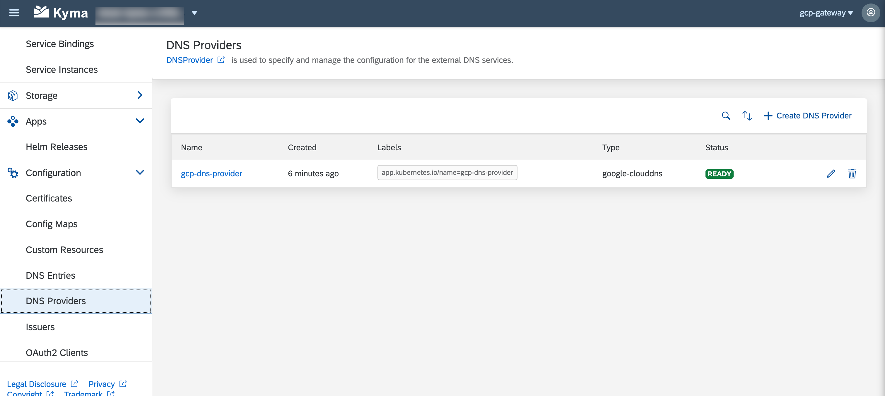](./images/dns-provider.png?raw=true).


### 6.2. Create DNS Entry 

On previous step you have informed your Kyma Cluster, which DNS Provider to use via creating the DNS Provider.
On this step you will tell your DNS Provider to use your domain to route your requests to your clusters ingress gateway.


----- WORK IN PROGRESS -----------


